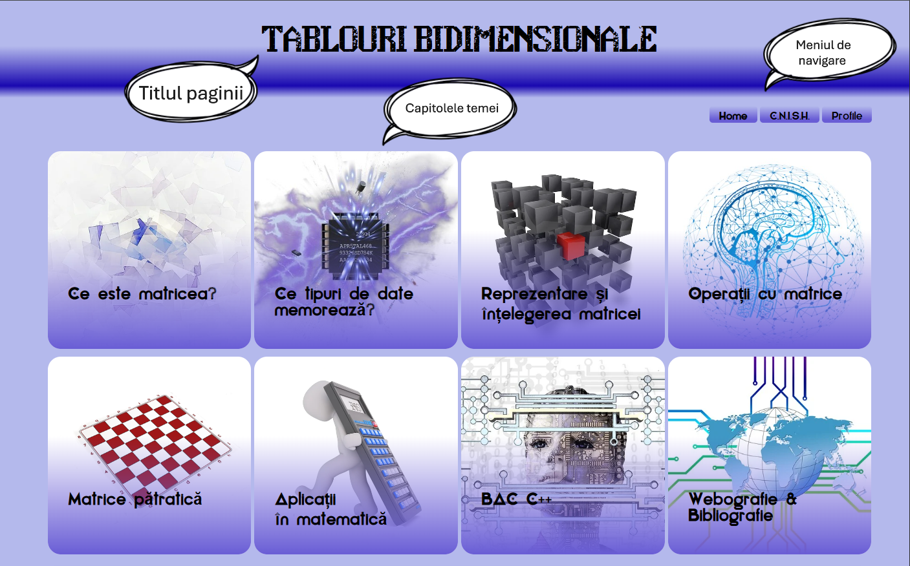
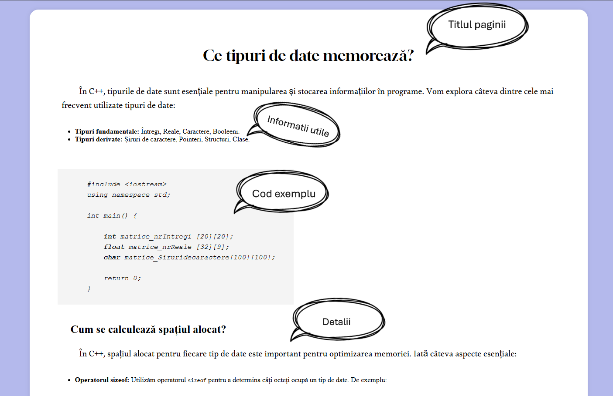
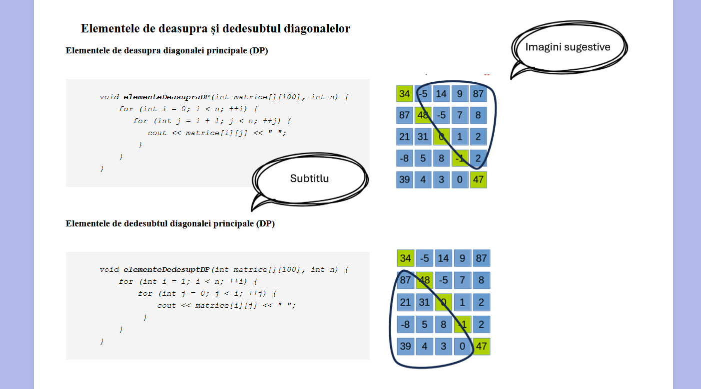
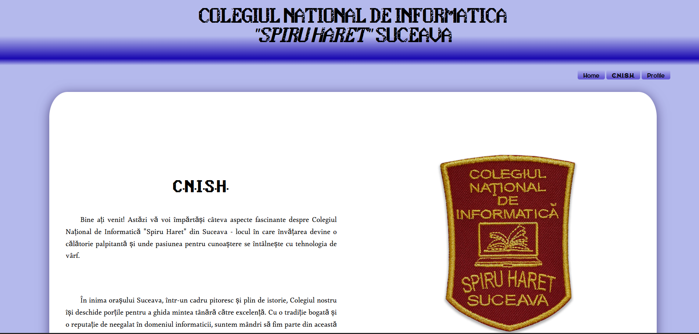
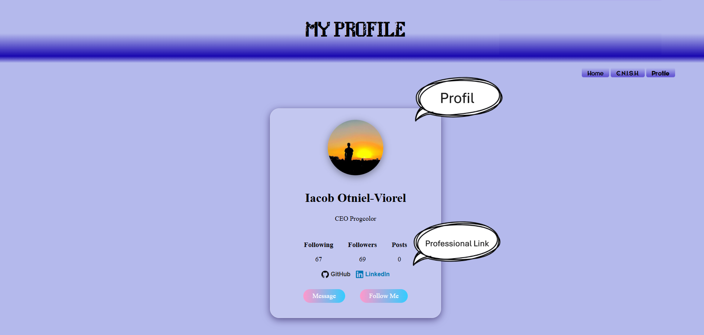

# 📊 Tablouri Bidimensionale - Platformă Educațională C++

Acest proiect reprezintă o platformă interactivă dedicată studiului matricelor (tablouri bidimensionale) în limbajul C++. Site-ul combină concepte teoretice, aplicații practice și probleme de nivel de Bacalaureat, fiind optimizat pentru elevii de profil informatică.

## 🚀 Demo Vizual

### Pagina Principală
Pagina de pornire oferă acces rapid la cele 8 capitole fundamentale ale temei, fiecare reprezentat printr-o iconiță intuitivă.

---

## 📖 Ce conține platforma?

Site-ul este structurat pe mai multe secțiuni cheie pentru a facilita învățarea:

### 1. Teorie și Tipuri de Date
Explicăm structura unei matrice și tipurile de date pe care le poate stoca (int, float, char), inclusiv modul în care se calculează spațiul alocat în memorie folosind `sizeof`.

### 2. Algoritmi și Vizualizare
Secțiunea dedicată matricelor pătratice include reprezentări vizuale sugestive pentru elementele de deasupra și de sub diagonalele principală și secundară, împreună cu snippet-uri de cod optimizate.

### 3. Secțiune de Profil & Colegiu
Platforma include detalii despre autor și instituția de proveniență, **Colegiul Național de Informatică "Spiru Haret" Suceava**.

---

## 🛠️ Cum se utilizează

1. **Navigare:** Folosiți meniul de navigare din colțul dreapta-sus pentru a schimba paginile (`Home`, `C.N.I.S.H.`, `Profile`).
2. **Capitole:** Pe pagina principală, dați click pe oricare dintre cele 8 cutii (box-uri) pentru a fi direcționat automat către explicația detaliată a acelui capitol.
3. **Cod Sursă:** Puteți copia exemplele de cod direct din secțiunile formatate special pentru a le testa în mediul de dezvoltare (ex: Code::Blocks sau Visual Studio).

---

## 👨‍💻 Autor
**Iacob Otniel-Viorel**

---

## 📚 Bibliografie
Proiectul a fost realizat utilizând resurse de specialitate:
* Manuale de informatică (Ed. Paralela 45, Sigma).
* Platforme online: PbInfo, InfoAs.
